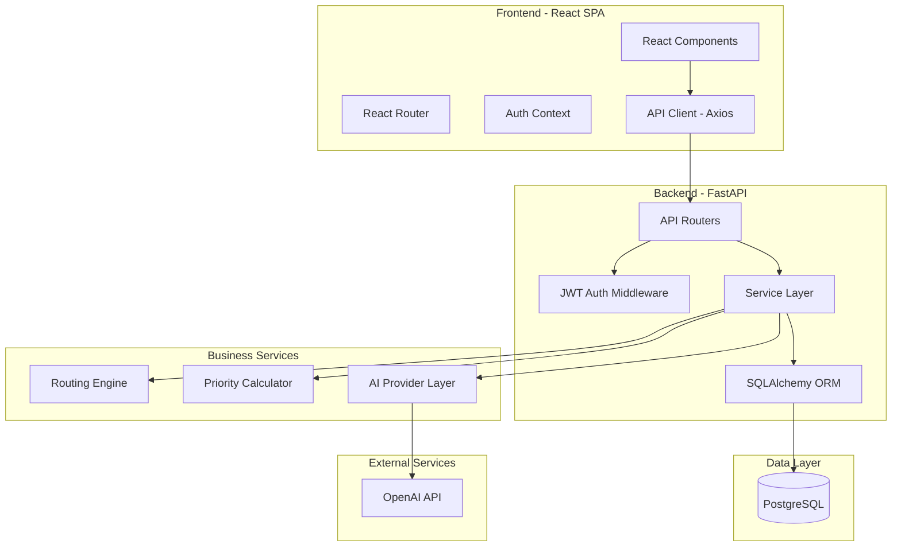
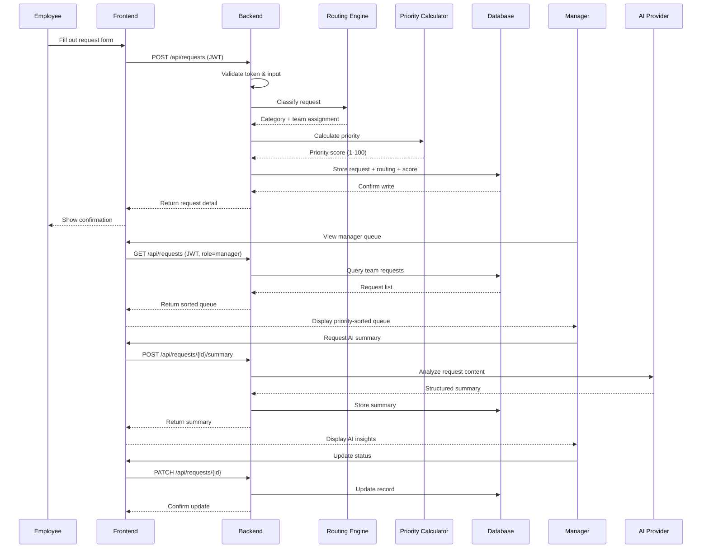
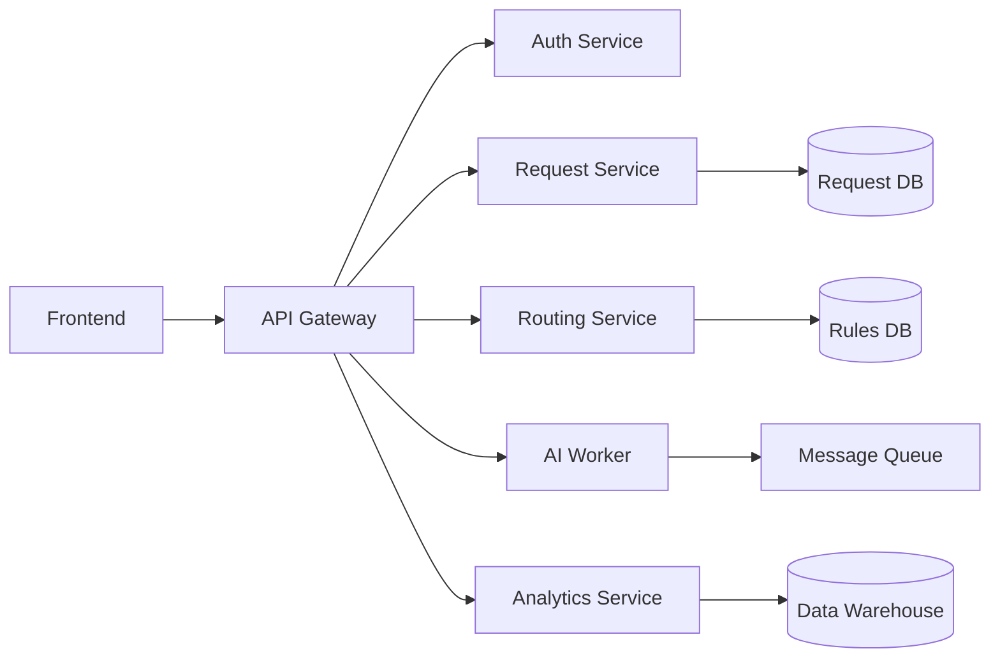
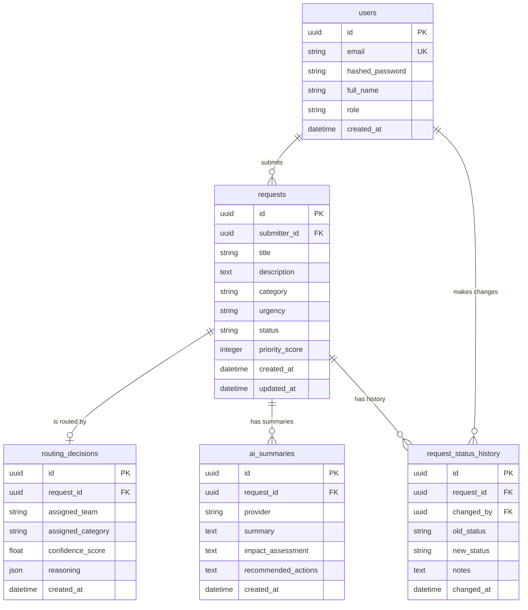

# ProcessPilot AI — Architecture Document

## System Overview

ProcessPilot AI is a three-tier web application following a client-server architecture with a relational database backend. The system is designed as a modular monolith — a single deployable unit with clearly separated internal service boundaries that can be extracted into independent microservices as scaling demands evolve.

The frontend is a React single-page application (SPA) that communicates exclusively through a RESTful API. The backend is a Python FastAPI application that handles authentication, business logic orchestration, and data persistence through SQLAlchemy ORM. PostgreSQL serves as the system of record for all application data.

AI capabilities are integrated through a provider abstraction layer that decouples the application from any specific AI vendor, enabling seamless switching between OpenAI and a deterministic mock provider.

## Architecture Diagram

## Service Descriptions

### Frontend (React SPA)

| Component | Responsibility |
|---|---|
| **React Components** | UI rendering with role-based views — dashboard, request form, detail view, analytics charts, manager queue |
| **React Router** | Client-side routing between views with protected route guards for authenticated users |
| **Auth Context** | Global authentication state management — stores JWT token, user profile, and role information |
| **API Client (Axios)** | Centralized HTTP client with JWT token injection, base URL configuration, and error interceptors |

### Backend (FastAPI)

| Component | Responsibility |
|---|---|
| **API Routers** | HTTP endpoint definitions organized by domain (auth, requests, analytics, health) with request/response schema validation via Pydantic |
| **JWT Auth Middleware** | Token validation on protected endpoints, user extraction from token claims, role-based access enforcement |
| **Service Layer** | Business logic orchestration — coordinates between routing, prioritization, AI, and data access |
| **SQLAlchemy ORM** | Object-relational mapping for database operations, model definitions, query construction, and transaction management |

### Business Services

| Service | Responsibility |
|---|---|
| **Routing Engine** | Classifies incoming requests by analyzing title and description keywords, maps them to predefined categories (IT, HR, Facilities, Procurement, Operations), and assigns them to the appropriate team |
| **Priority Calculator** | Computes a numeric priority score (1–100) based on weighted factors: urgency level (40%), business impact (35%), and category weight (25%). Higher scores indicate higher priority |
| **AI Provider Layer** | Abstraction over AI capabilities with three modes: `openai` (live API calls), `mock` (deterministic responses), and `auto` (try OpenAI, fall back to mock). Generates request summaries, impact assessments, and action recommendations |

### Data Layer

| Component | Responsibility |
|---|---|
| **PostgreSQL** | Persistent storage for all application data with ACID compliance, referential integrity, and indexing for query performance |
| **Alembic** | Schema migration management — version-controlled database changes that can be applied, rolled back, and audited |

## Request Lifecycle

The following walkthrough traces a request from initial submission through resolution, touching every system component:

### 1. Submission
An employee fills out the request form in the React frontend, providing a title, description, category, and urgency level. The form validates inputs client-side before submission.

### 2. API Call
The frontend's API client sends a `POST /api/requests` with the request payload and the user's JWT token in the `Authorization` header.

### 3. Authentication
The backend's JWT middleware extracts and validates the token, retrieves the user identity from the token claims, and injects it into the request context.

### 4. Validation
FastAPI's Pydantic models validate the request body against the defined schema, rejecting malformed inputs with descriptive error messages.

### 5. Routing
The service layer passes the request to the **Routing Engine**, which analyzes the title and description against keyword patterns and assigns a category and responsible team. The routing decision is stored alongside the request.

### 6. Prioritization
The **Priority Calculator** scores the request based on the assigned category weight, the employee-specified urgency, and the inferred business impact. The score determines queue ordering for managers.

### 7. Persistence
SQLAlchemy creates the request record, the routing decision, and the priority score in a single database transaction, ensuring data consistency.

### 8. Response
The API returns the complete request object including routing decision and priority score. The frontend navigates to the request detail view.

### 9. Manager Review
Managers see incoming requests in their queue, sorted by priority score. They can update status (in_progress, resolved, closed) and add notes.

### 10. AI Summary (On-Demand)
When a manager clicks "Generate Summary," the frontend calls `POST /api/requests/{id}/summary`. The AI provider analyzes the request and returns a structured summary with business impact assessment and recommended actions.

### 11. Analytics
The analytics service aggregates request data to surface trends — volume over time, category distribution, average resolution time, and operational bottlenecks.

## Data Flow Diagram

## Cloud Migration Mapping

This application architecture directly maps to enterprise cloud migration patterns. The following table shows how each component would be deployed across major cloud providers:

| App Component | AWS | Azure | IBM Cloud |
|---|---|---|---|
| **Frontend (React SPA)** | S3 + CloudFront CDN | Azure Static Web Apps | IBM Cloud Object Storage + CDN |
| **Backend (FastAPI)** | ECS Fargate | Azure Container Apps | IBM Code Engine |
| **Database (PostgreSQL)** | Amazon RDS | Azure Database for PostgreSQL | IBM Cloud Databases for PostgreSQL |
| **AI Service** | Amazon Bedrock / OpenAI API | Azure OpenAI Service | IBM watsonx.ai |
| **Load Balancer** | Application Load Balancer | Azure Application Gateway | IBM Cloud Internet Services |
| **Container Registry** | Amazon ECR | Azure Container Registry | IBM Container Registry |
| **Secrets Management** | AWS Secrets Manager | Azure Key Vault | IBM Secrets Manager |
| **Logging & Monitoring** | CloudWatch | Azure Monitor | IBM Log Analysis + Monitoring |
| **Infrastructure as Code** | Terraform | Terraform / Bicep | Terraform / IBM Schematics |

This portability demonstrates that the architecture is cloud-agnostic by design — the same Docker containers and Terraform patterns adapt to any cloud provider with minimal configuration changes.

## Microservice Evolution Path

The current codebase is a modular monolith — a single deployable with well-defined internal boundaries. Here is how it could evolve into a microservices architecture as scaling needs emerge:

### Phase 1: Extract Routing Service
The routing engine has a clean interface (input: request text, output: category + team). It could become a standalone HTTP service with its own API, allowing independent scaling and deployment. Other systems could also call it directly.

### Phase 2: Async AI Worker
AI summary generation is the most latency-variable operation. Extract it into an async worker that consumes from a message queue (SQS, RabbitMQ). The API would enqueue summary requests and return immediately; results would be pushed to the frontend via WebSocket or polling.

### Phase 3: Analytics as Read Service
Analytics queries can be expensive on the primary database. A dedicated analytics service could read from a replica or a denormalized data warehouse, optimized for aggregation queries without impacting transactional performance.

### Phase 4: API Gateway
With multiple backend services, an API gateway (Kong, AWS API Gateway) would handle routing, rate limiting, authentication, and cross-cutting concerns in a single entry point.

## Security Architecture

### Authentication Flow

1. User submits email + password to `POST /api/auth/login`
2. Backend verifies credentials against hashed passwords (bcrypt) in the database
3. On success, backend generates a JWT containing user ID, email, and role
4. JWT is returned to the frontend, which stores it in memory (not localStorage for XSS protection)
5. Subsequent API calls include the JWT in the `Authorization: Bearer <token>` header
6. Backend middleware validates the token signature and expiration on every protected endpoint

### Authorization

- **Employee role:** Can create requests, view their own requests, and see their own analytics
- **Manager role:** All employee permissions plus viewing team queues, updating any request status, generating AI summaries, and accessing full analytics

### Security Measures

| Layer | Measure |
|---|---|
| **Transport** | HTTPS enforced in production (TLS termination at load balancer) |
| **Authentication** | JWT with configurable expiration, bcrypt password hashing |
| **Authorization** | Role-based middleware on protected endpoints |
| **API** | CORS configuration restricting allowed origins |
| **Input** | Pydantic schema validation on all request bodies |
| **Database** | Parameterized queries via SQLAlchemy ORM (prevents SQL injection) |
| **Secrets** | Environment variables, never committed to source control |
| **Network** | Security groups restricting traffic flow (ALB → ECS → RDS) |

## Database Schema

### Table Descriptions

| Table | Purpose |
|---|---|
| **users** | Employee and manager accounts with hashed credentials and role assignments |
| **requests** | Core business entity — operational requests with category, urgency, status, and computed priority |
| **routing_decisions** | Output of the routing engine — which team and category a request was assigned to, with confidence scoring |
| **ai_summaries** | AI-generated analysis stored for each request, including provider tracking for auditability |
| **request_status_history** | Audit trail of all status changes with timestamps, who made the change, and optional notes |
