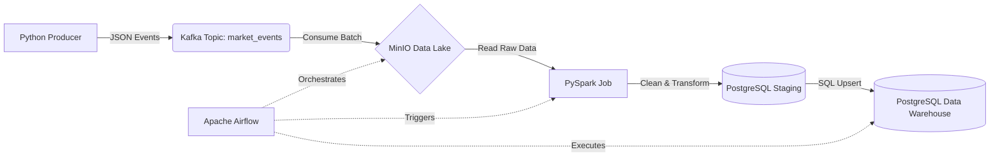

# Real-Time Market Data Pipeline

A complete, end-to-end data engineering portfolio project demonstrating a modern ETL/ELT pipeline. It ingests synthetic market data (stock and crypto trades), streams it via Apache Kafka, stores raw data in a local MinIO (S3-compatible) data lake, transforms it using PySpark, and loads it into a PostgreSQL data warehouse modeled with a Star Schema. The entire workflow is orchestrated with Apache Airflow.

## Architecture



## Tech Stack

- **Python 3.11+**: Synthetic data generator and basic consumers.
- **Apache Kafka**: Streaming event bus for high-throughput market events.
- **MinIO**: S3-compatible local object storage serving as the raw data lake.
- **PySpark**: Distributed data processing, cleaning, and schema inference.
- **PostgreSQL**: Data warehouse holding the final Star Schema (Fact and Dimension tables).
- **Apache Airflow**: Workflow orchestration and SQL-based data quality checks.
- **Docker Compose**: Containerized infrastructure for easy local deployment.

## Project Structure

```text
real-time-market-data-pipeline/
├── dags/                           # Airflow DAGs
│   └── market_data_pipeline.py     # End-to-end orchestration pipeline
├── docker-compose.yml              # All local infrastructure
├── Makefile                        # Helpful commands for running the project
├── README.md                       # Project documentation
├── requirements.txt                # Python dependencies
├── spark_jobs/                     # PySpark transformation scripts
│   └── transform_market_data.py    
├── sql/                            # SQL scripts
│   ├── analytics_queries.sql       # Sample analytic queries
│   ├── indexes.sql                 # Performance optimizations
│   ├── init-db.sql                 # Database initialization script
│   └── schema.sql                  # Data warehouse Star Schema DDL
└── src/
    ├── consumers/                  
    │   └── minio_writer.py         # Kafka to MinIO ingestion
    └── producers/                  
        └── market_event_producer.py# Synthetic data generator
```

## Setup Instructions

**Prerequisites:** You need Docker and Docker Compose installed on your machine. At least 8-16GB of RAM is recommended to run all services simultaneously.

1. **Clone the repository and enter the directory:**
   ```bash
   cd real-time-market-data-pipeline
   ```

2. **Start the infrastructure:**
   ```bash
   make up
   ```
   *This starts Zookeeper, Kafka, MinIO, PostgreSQL, Spark, and Airflow. Wait a couple of minutes for Airflow to initialize.*

3. **Verify Services:**
   - Airflow UI: [http://localhost:8081](http://localhost:8081) (admin/admin)
   - MinIO Console: [http://localhost:9001](http://localhost:9001) (minioadmin/minioadmin)
   - Spark UI: [http://localhost:8080](http://localhost:8080)

## Running the Pipeline

1. **Generate Synthetic Data** (publishes to Kafka):
   ```bash
   make generate-data
   ```
   *This generates 100,000 market events and sends them to the `market_events` Kafka topic.*

2. **Trigger the Pipeline**:
   Access the Airflow UI at `http://localhost:8081`, locate the `batch_ingest_market_data` DAG, unpause it, and trigger it manually. Alternatively, you can use the Makefile:
   ```bash
   make run-pipeline
   ```

3. **Explore the Data**:
   Connect to the PostgreSQL data warehouse to run analytics queries:
   ```bash
   make shell-postgres
   ```
   Then run the queries found in `sql/analytics_queries.sql`.

## Data Quality Checks & Performance

- **Data Quality**: The Airflow DAG includes tasks that run SQL-based checks on the `fact_market_events` table to ensure no null `event_ids`, no negative prices or volumes, and no duplicate records.
- **Indexing**: After data is loaded, Airflow applies composite indexes on `symbol_id` and `timestamp` to drastically improve query performance for time-series analytics. 

## Resume Bullets
- Architected and deployed an end-to-end data pipeline using Docker Compose, integrating Kafka, MinIO, PySpark, PostgreSQL, and Airflow to process over 100,000 synthetic market events locally.
- Designed a scalable Star Schema data warehouse in PostgreSQL, implementing SCD Type 1 dimensions and optimizing time-series queries with composite B-tree indexes.
- Engineered a PySpark batch transformation layer to clean, deduplicate, and enrich raw JSON data from an S3-compatible data lake (MinIO), loading it into PostgreSQL via JDBC.
- Orchestrated the entire ELT workflow with Apache Airflow, incorporating automated SQL-based data quality checks to prevent nulls, negative prices, and duplicates from entering the final analytics layer.
